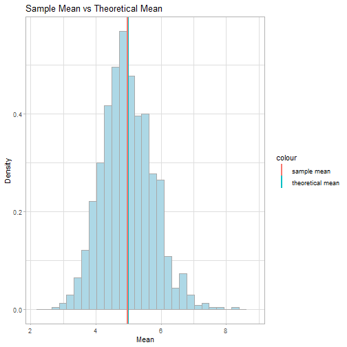

## Overview

```
## In this project you will investigate the exponential distribution in R and compare it with the Central Limit Theorem. The exponential distribution can be simulated in R with rexp(n, lambda) where lambda is the rate parameter. The mean of exponential distribution is 1/lambda and the standard deviation is also 1/lambda. Set lambda = 0.2 for all of the simulations. You will investigate the distribution of averages of 40 exponentials.
```

## Simulations

```
FALSE Illustrate via simulation and associated explanatory text the properties of the distribution of the mean of 40 exponentials. You should
FALSE 
FALSE 1. Show the sample mean and compare it to the theoretical mean of the distribution.
FALSE 2. Show how variable the sample is (via variance) and compare it to the theoretical variance of the distribution.
FALSE 3. Show that the distribution is approximately normal.
```


```r
# set seed for randomness
set.seed(12345)
n <- 40         # exponentials set to n
lambda <- 0.2   # Set lambda = 0.2 
samples <- 1000 # No. of simulations

# 1000 random simulations
mns <- NULL
for (i in 1 : samples) {
        mns = c(mns, mean(rexp(n, lambda)))
}
```


## Sample Mean versus Theoretical Mean

```r
cat("Calculating the mean from the simulations with give the sample mean.")
```

```
## Calculating the mean from the simulations with give the sample mean.
```

```r
# the means of simulations
sample_mean <- mean(mns)
# theoretical mean
theoretical_mean <- 1 / lambda
df <- data.frame(mns)
g <- ggplot(df, aes(x = mns))+
  geom_histogram(aes(y = ..density..), fill = "lightblue", color = "darkgrey")+
  xlim(range(density(mns)$x))+
  theme_light()

g2 <- g + geom_vline(aes(xintercept = sample_mean, color="sample mean"), lwd = 1)+
  geom_vline(aes(xintercept = theoretical_mean, color="theoretical mean"))+
  labs(title = "Sample Mean vs Theoretical Mean", x = "Mean", y = "Density")+
  theme_light()

g2
```



### Theoretical Mean

```r
cat("The theoretical mean of an exponential distribution is lambda^-1. 
    This will shows us that our sample mean is is pretty close to our theoretical mean.")
```

```
## The theoretical mean of an exponential distribution is lambda^-1. 
##     This will shows us that our sample mean is is pretty close to our theoretical mean.
```

```r
data.frame(Sample.Mean = sample_mean, Theoretical.Mean = theoretical_mean, Lambda = lambda^-1)
```

```
##   Sample.Mean Theoretical.Mean Lambda
## 1    4.971972                5      5
```
 

## Sample Variance versus Theoretical Variance

```r
cat("Let us view some variance of the simulations; the variance from the simulation means with give the sample variance")
```

```
## Let us view some variance of the simulations; the variance from the simulation means with give the sample variance
```

```r
sample_var <- var(mns)
# theoretical variance
theoretical_var <- (1 / lambda) ^2 / n
data.frame(Sample.Variance = sample_var, Theoretical.Variance = theoretical_var)
```

```
##   Sample.Variance Theoretical.Variance
## 1       0.5954369                0.625
```


### Comparison

```r
cat("We can see some slight differences between the simulations sample variance & 
the exponential distribution.") 
```

```
## We can see some slight differences between the simulations sample variance & 
## the exponential distribution.
```

```r
data.frame(Differences = abs(var(mns)-(lambda * sqrt(n))^-2))
```

```
##   Differences
## 1   0.0295631
```

## Distribution

```r
cat("Density histogram of simulations with an overlay of normal distribution, has a mean of lambda^-1 and standard deviation of (lambda*sqrt(n))^-1.")
```

```
## Density histogram of simulations with an overlay of normal distribution, has a mean of lambda^-1 and standard deviation of (lambda*sqrt(n))^-1.
```

```r
# standard deviation
theoretical_sd <- 1 / (lambda * sqrt(n))

  g3 <- g + geom_density(aes(y = ..density..), color = "red", lwd = 1.0)+
  stat_function(fun = dnorm, args = list(mean = theoretical_mean, sd = theoretical_sd), color = "darkblue", lwd = 1.0)+
  labs(title = "Below shows us that the distribution (red line) is approximately normal (blue line).", x = "Mean", y = "Density")

g3
```


