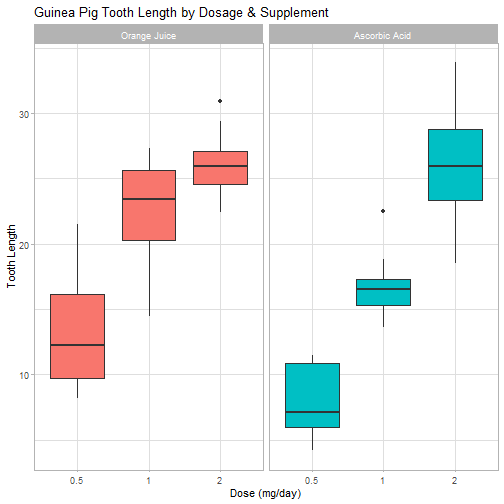

### Overview

```r
cat("Now in the second portion of the project, we're going to analyze the ToothGrowth data in the R datasets package.

1. Load the ToothGrowth data and perform some basic exploratory data analyses
2. Provide a basic summary of the data.
3. Use confidence intervals and/or hypothesis tests to compare tooth growth by supp and dose. (Only use the techniques from class, even if there's other approaches worth considering)
4. State your conclusions and the assumptions needed for your conclusions.")
```

```
## Now in the second portion of the project, we're going to analyze the ToothGrowth data in the R datasets package.
## 
## 1. Load the ToothGrowth data and perform some basic exploratory data analyses
## 2. Provide a basic summary of the data.
## 3. Use confidence intervals and/or hypothesis tests to compare tooth growth by supp and dose. (Only use the techniques from class, even if there's other approaches worth considering)
## 4. State your conclusions and the assumptions needed for your conclusions.
```

### Load Data the ToothGrowth so we can perform exploratory analyses

```r
library(datasets)
library(ggplot2)

data(ToothGrowth) # load the data

head(ToothGrowth)
summary(ToothGrowth)
?ToothGrowth # look in help section for details about the data
```

### Description

```r
cat("The response is the length of odontoblasts (cells responsible for tooth growth) in 60 guinea pigs. Each animal received one of three dose levels of vitamin C (0.5, 1, and 2 mg/day) by one of two delivery methods, orange juice or ascorbic acid (a form of vitamin C and coded as VC).
")
```

```
## The response is the length of odontoblasts (cells responsible for tooth growth) in 60 guinea pigs. Each animal received one of three dose levels of vitamin C (0.5, 1, and 2 mg/day) by one of two delivery methods, orange juice or ascorbic acid (a form of vitamin C and coded as VC).
```

```r
tg <- ToothGrowth
levels(tg$supp) <- c("Orange Juice", "Ascorbic Acid")

ggplot(tg, aes(x=factor(dose), y=len)) + 
  facet_grid(.~supp) +
  geom_boxplot(aes(fill = supp), show_guide = FALSE) +
  labs(title="Guinea Pig Tooth Length by Dosage & Supplement", 
       x="Dose (mg/day)",
       y="Tooth Length") +
  theme_light()
```

```
## Warning: `show_guide` has been deprecated. Please use `show.legend` instead.
```



### Basic summary of the data

```r
cat("We can deduce that increasing the dosage increases the tooth growth. Orange juice at .5 is more effective at 1.0 milligrams per day. Supplements at 2.0 milligrams per day are both equally effective")
```

```
## We can deduce that increasing the dosage increases the tooth growth. Orange juice at .5 is more effective at 1.0 milligrams per day. Supplements at 2.0 milligrams per day are both equally effective
```

```r
df <- data.frame(summary(ToothGrowth))
df <- df[,-1]
df <- na.omit(df)
df
```

```
##         Var2            Freq
## 1        len Min.   : 4.20  
## 2        len 1st Qu.:13.07  
## 3        len Median :19.25  
## 4        len Mean   :18.81  
## 5        len 3rd Qu.:25.27  
## 6        len Max.   :33.90  
## 7       supp         OJ:30  
## 8       supp         VC:30  
## 13      dose Min.   :0.500  
## 14      dose 1st Qu.:0.500  
## 15      dose Median :1.000  
## 16      dose Mean   :1.167  
## 17      dose 3rd Qu.:2.000  
## 18      dose Max.   :2.000
```

### Use confidence intervals & hypothesis tests to compare tooth growth by supplement and dose
#### Hypothesis No. 1
Orange Juice & Ascorbic Acid deliver the same tooth growth across the data set."

```r
h1<-t.test(len ~ supp, data = tg)

Confidence.Interval <- h1$conf.int
P.Value <- h1$p.value

data.frame(Confidence.Interval = Confidence.Interval)
```

```
##   Confidence.Interval
## 1          -0.1710156
## 2           7.5710156
```

```r
data.frame(P.Value = P.Value)
```

```
##      P.Value
## 1 0.06063451
```
The p-value of this test was 0.06.
Since the p-value is greater than 0.05 and the confidence interval of the test contains zero we can say that supplement types seems to have no impact on Tooth growth based on this test.


#### Hypothesis No. 2
Dosage of 0.5 mg/day, two supplements deliver the same tooth growth.

```r
h2<-t.test(len ~ supp, data = subset(tg, dose %in% c(0.5, 1)))
Confidence.Interval <- h2$conf.int
P.Value <- h2$p.value

data.frame(Confidence.Interval = Confidence.Interval)
```

```
##   Confidence.Interval
## 1            1.875234
## 2            9.304766
```

```r
data.frame(P.Value = P.Value)
```

```
##      P.Value
## 1 0.00423861
```
The confidence interval does not include 0 and the p-value is below the 0.05 
threshold. The null hypothesis can be rejected. 

#### Hypothesis No. 3
For the dosage of 1 mg/day, the two supplements deliver the same tooth growth

```r
h3<-t.test(len ~ supp, data = subset(tg, dose %in% c(1, 2)))
Confidence.Interval <- h3$conf.int
P.Value <- h3$p.value

data.frame(Confidence.Interval = Confidence.Interval)
```

```
##   Confidence.Interval
## 1          -0.3166175
## 2           6.1666175
```

```r
data.frame(P.Value = P.Value)
```

```
##      P.Value
## 1 0.07532836
```
As can be seen, the p-value of each test was essentially zero and the confidence interval of each test does not cross over zero.
Based on this result we can assume that the average tooth length increases with an increasing dose, and therefore the null hypothesis can be rejected.


### Conclusions & Assumptions
Orange Juice delivers more tooth growth than ascorbic acid.
Orange juice and ascorbic acid deliver the same amount of tooth growth for dose amount 2.0 mg/day.  
We cannot conclude orange juice is more effective that ascorbic acid.

Assumptions
- We can conclude that supplement type has no effect on tooth growth
- Increasing the dose level leads to increased tooth growth
