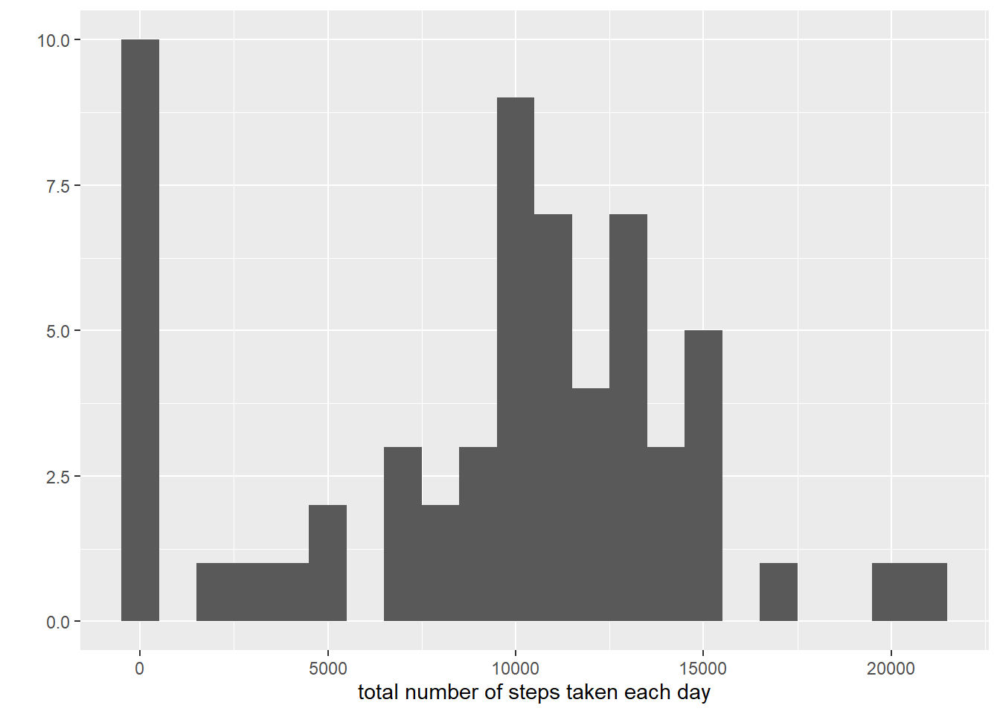
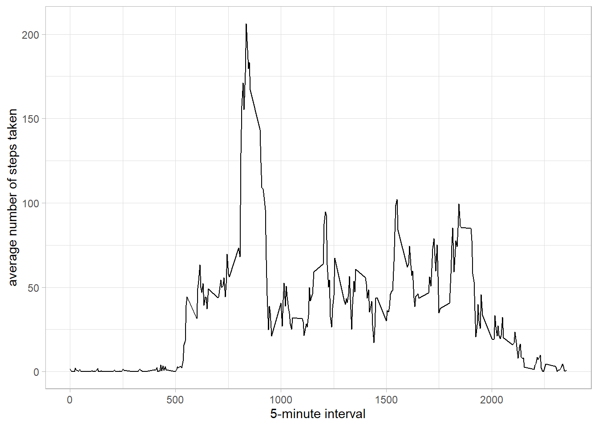
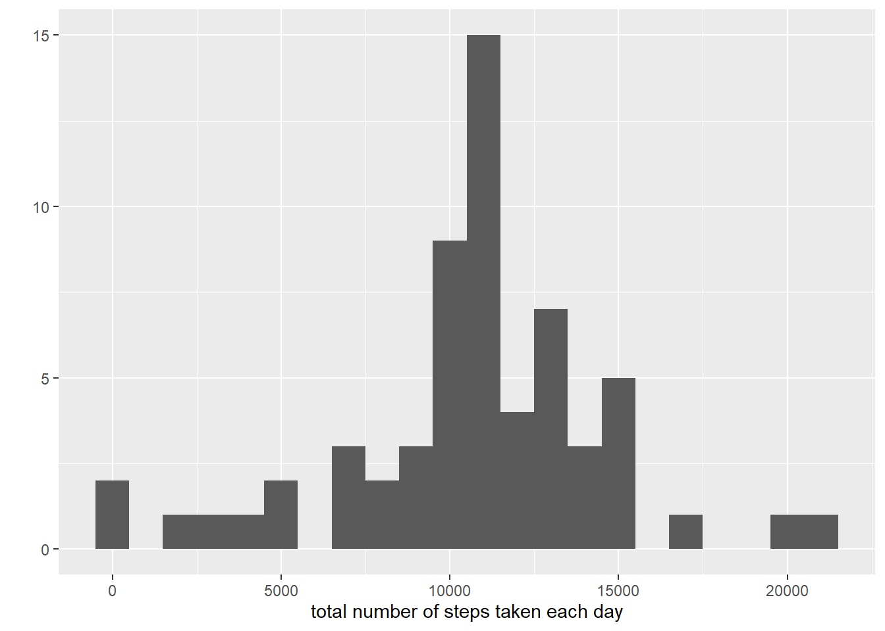
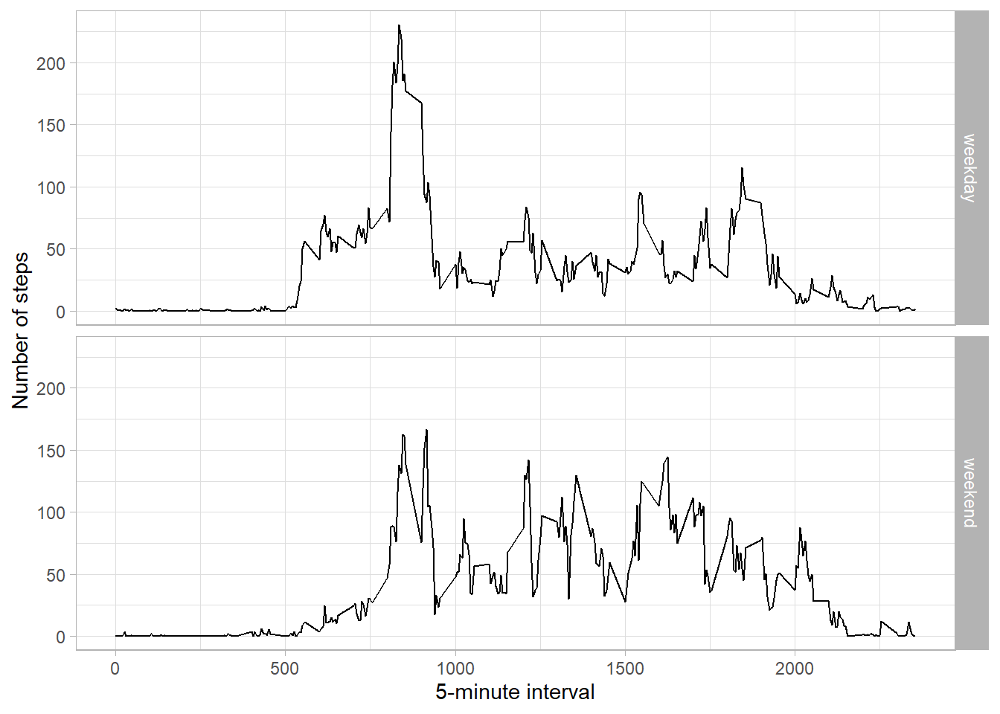

# Reproducible_Research_week_2_assignmement

## Loading and preprocessing the data
```{r loaddata}
unzip(zipfile="activity.zip")
data <- read.csv("activity.csv")
```


## What is mean total number of steps taken per day?
```{r}

total.steps <- tapply(data$steps, data$date, FUN=sum, na.rm=TRUE)

paste("Mean.Total.Steps",round(mean(total.steps, na.rm=TRUE), digits = 2))
paste("Median.Total.Steps", round(median(total.steps, na.rm=TRUE), digits = 2))

qplot(total.steps, binwidth=1000, xlab="total number of steps taken each day")
```
 

```
[1] "Mean.Total.Steps 9354.23"
[1] "Median.Total.Steps 10395"
```


## What is the average daily activity pattern?
```{r}
averages <- aggregate(x=list(steps=data$steps), by=list(interval=data$interval),
                      FUN=mean, na.rm=TRUE)
ggplot(data=averages, aes(x=interval, y=steps)) +
    geom_line() +
    xlab("5-minute interval") +
    ylab("average number of steps taken") + theme_light()
```

 

On average across all the days in the dataset, the 5-minute interval contains the maximum number of steps?
```{r}
averages[which.max(averages$steps),]
```
```
[1] "Interval 835"
[1] "steps 206.1698"
```

## Imputing missing values
There are many days/intervals where there are missing values (coded as `NA`). The presence of missing days may introduce bias into some calculations or summaries of the data.

```{r}
missing <- is.na(data$steps)

table(missing)
```
```
missing
FALSE  TRUE 
15264  2304 
```


All of the missing values are filled in with mean value for that 5-minute interval.
```{r}
# Replace each missing value with the mean value of its 5-minute interval
fill.value <- function(steps, interval) {
    filled <- NA
    if (!is.na(steps))
        filled <- c(steps)
    else
        filled <- (averages[averages$interval==interval, "steps"])
    return(filled)
}
filled.data <- data
filled.data$steps <- mapply(fill.value, filled.data$steps, filled.data$interval)
```

Now, using the filled data set, let's make a histogram of the total number of steps taken each day and calculate the mean and median total number of steps.

```{r}
total.steps <- tapply(filled.data$steps, filled.data$date, FUN=sum)

paste("Mean.Total.Steps", round(mean(total.steps, na.rm=TRUE), digits = 2))
paste("Median.Total.Steps", round(median(total.steps, na.rm=TRUE), digits = 2))

qplot(total.steps, binwidth=1000, xlab="total number of steps taken each day")
```
 

```
[1] "Mean.Total.Steps 10766.19"
[1] "Median.Total.Steps 10766.19"
```

Mean and median values are higher after imputing missing data. The reason is
that in the original data, there are some days with `steps` values `NA` for 
any `interval`. The total number of steps taken in such days are set to 0s by
default. However, after replacing missing `steps` values with the mean `steps`
of associated `interval` value, these 0 values are removed from the histogram
of total number of steps taken each day.

## Are there differences in activity patterns between weekdays and weekends?
```{r}
weekday.or.weekend <- function(date) {
    day <- weekdays(date)
    if (day %in% c("Monday", "Tuesday", "Wednesday", "Thursday", "Friday"))
        return("weekday")
    else if (day %in% c("Saturday", "Sunday"))
        return("weekend")
    else
        stop("invalid date")
}

filled.data$date <- as.Date(filled.data$date)
filled.data$day <- sapply(filled.data$date, FUN=weekday.or.weekend)
```

Make a panel plot containing plots of average number of steps taken
on weekdays and weekends.
```{r}
averages <- aggregate(steps ~ interval + day, data=filled.data, mean)

ggplot(averages, aes(interval, steps)) + geom_line() + facet_grid(day ~ .) +
    xlab("5-minute interval") + ylab("Number of steps") + theme_light()
```
 


